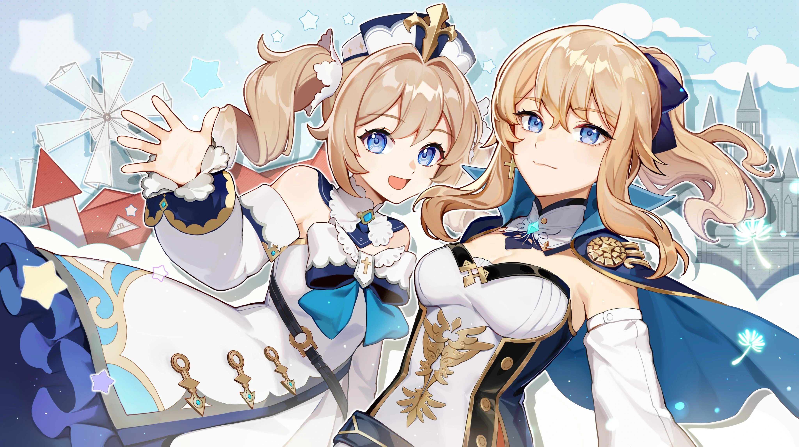
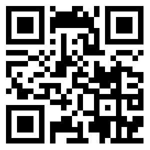

# Hello there :wave:

## Surprise~
Scan this QR code, then scan the profile pic for surprise!

<!--
**xenoney/xenoney** is a :sparkles: _special_ :sparkles: repository because its `README.md` (this file) appears on your GitHub profile.

Here are some ideas to get you started:

- :telescope: I’m currently working on ...
- :seedling: I’m currently learning ...
- :people_with_bunny_ears_partying: I’m looking to collaborate on ...
- :thinking: I’m looking for help with ...
- :speech_balloon: Ask me about ...
- :mailbox: How to reach me: ...
- :smile: Pronouns: ...
- :zap: Fun fact: ...
-->